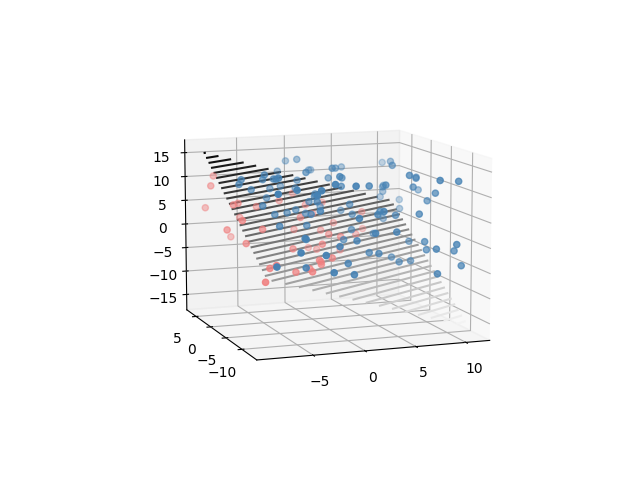
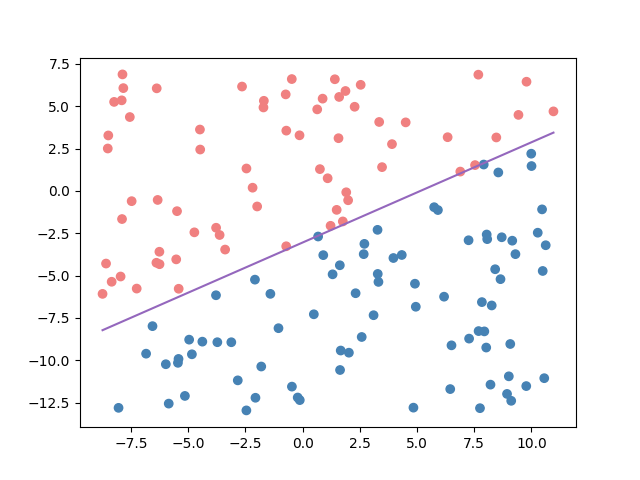

# Perceptron-Example
This project contains source code for a simple perceptron implementation with some examples.




# How to use?
For an online example on Google Colab go to [this link](https://colab.research.google.com/drive/1ML1a4CPC-CfCdRvJToqiMbpEmbCCXVbU?usp=sharing). Just copy the notebook to your account and run all the cells, everything is explained there. 

[](https://colab.research.google.com/drive/1ML1a4CPC-CfCdRvJToqiMbpEmbCCXVbU?usp=sharing)

--------------

If instead you want a local copy of this project theL

On your local machine clone this repo:

```
git clone https://github.com/DanielEliasib/Perceptron-Example
```

or download as a zip.

Run `pip3 install -r requirements.txt` to ensure that you have all the required packages.

Finally run:

```
python3 perceptron.py
```

to run the default example or 

```
python3 perceptron.py -d nameFile
```

to load a custom file. Four examples are provided and can be loaded as noted above.

> **Note:** The data must be in json format, add an array called 'points' to specify your data points and one called 'labels' to specify their classes, both must be of the same size and every point has to be an array of floats or ints. 

Refer to Data/example2D-1.json for a small example on how to add custom data. 

Please note that the code automatically search for the data inside the **Data** folder, please add your own files there and only provide its name to the program.

For more information run:

```
python3 perceptron.py --help
```

### Example command

```
python3 perceptron.py -d example2D-1.json -it 20
```
## Important
- Note that it will always save the result as 'result2D.png' or 'result3D.png', so if you want to save the results for later copy them somewhere else before running the program again. 

- For the 3D examples I recommend running this program on a graphical environment for better visualization.